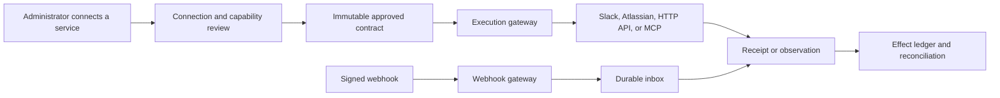

# External integration architecture

**Status:** Axiom 2.0 local gateway implemented; no live provider tenant is claimed  
**Reviewed against official documentation:** 2026-09-25

## Decision

Axiom adds external systems through one governed connector gateway, not by giving a model a URL, token, or unrestricted MCP server. The Axiom 2.0 local build implements the outbound core and bounded Slack, Jira Cloud, Confluence Cloud, and webhook presets. Approved OpenAPI services, remote MCP servers, inbound webhooks, automated retry, and provider-specific reconciliation remain later delivery lanes:

The shared gateway handles server-side credential references, strict schemas, bounded in-process rate admission, audit, and redaction. Each approved operation must still declare its business meaning, read/write effect, required scopes, approval rule, retry rule, and reconciliation procedure. Neither an OpenAPI document nor an MCP tool annotation establishes those facts by itself. The current runtime stores retry policy metadata and can classify retry advice, but does not automatically retry external calls.

This approach is intended to make new connectors fast to add while retaining Axiom's prepared-action and exact-approval guarantees. It is a product direction, not a verified claim that Axiom is already better than n8n or any other product. That comparison needs repeatable connector, recovery, governance, and usability benchmarks.

No architecture can honestly promise every external system without knowing its protocol and authority model. Axiom should cover the practical space through four reviewed lanes:

| Lane | Best fit |
| --- | --- |
| Native adapter | High-value providers such as Slack and Atlassian where OAuth installation, webhooks, rate limits, and reconciliation need provider-specific behavior. |
| OpenAPI 3.1 adapter | HTTPS APIs with a usable machine-readable contract and one of the supported authentication profiles. Each selected operation becomes its own reviewed capability. |
| Remote MCP adapter | MCP servers that expose tools/resources over a supported protocol revision and authorization flow. Each imported tool is reviewed and pinned. |
| Connector SDK | Databases, queues, file transfer, proprietary signing, vendor SDKs, on-premise bridges, or APIs whose behavior cannot be represented safely by the generic adapters. The developer supplies tests and effect/recovery rules. |

Inbound signed webhooks can start or resume workflows through the same gateway. Browser automation and shell commands are separate, narrowly authorized capabilities; they are not generic fallbacks when an API connector is missing.

## Axiom 2.0 implementation snapshot

The runnable local application now includes:

- A persisted connection catalog and Connections workspace for Slack, Jira Cloud, Confluence Cloud, and exact-destination outbound webhooks. Administrators select only reviewed preset operations; browser-supplied executable operations are rejected.
- Server-side `env:` credential references. Public API and interface records expose only whether references were configured and whether the corresponding environment values are currently available; they do not expose names, paths, or secret values.
- Read-only provider health operations for Slack and Atlassian presets, plus explicitly registered read invocation. Direct connection invocation cannot perform a write.
- Strict request and response schemas, exact native-provider origin/path pinning, HTTPS and port rules, DNS/address checks, redirect refusal, response-size limits, timeouts, bounded rate admission, and audited call metadata.
- Stable per-connection capability IDs. A ready connection's reviewed operations can appear in the Agent Factory capability catalog, where a specification and caller must still authorize the capability.
- External Goal Agent writes prepared as exact stored calls. Approval binds the connection version/generation, operation/version, destination, method, arguments, body, operation identity, evidence, source versions, and plan hash. Relevant successful reads are rechecked before commit; a changed or revoked connection invalidates the action.
- Explicit unknown-outcome handling. A timeout or uncertain external write is stopped for provider-specific or human reconciliation and is not retried blindly.
- Connection creation, safe testing where a registered health read exists, read invocation, revocation, and restoration APIs with audit records and generation-aware stale-result rejection.
- A bounded OpenAPI 3.1 JSON inspector and candidate compiler in `app/integrations.py`. Administrators can submit a fully inlined JSON document to an inspect-only HTTP/UI flow; it returns non-executable, unclassified candidates and a document hash. A separate MCP `tools/list` client contract remains a developer-facing module primitive.

No Slack workspace, Atlassian site, or external webhook receiver was authenticated during local verification. The current application does not implement an OAuth consent/callback/refresh lifecycle, a configured remote MCP host client, reviewed generic OpenAPI activation through HTTP/UI, automatic external retries, an external reconciliation workbench, or an inbound webhook receiver. It also retains seeded development identities and one local SQLite workspace rather than production authentication and tenant isolation.

## Non-negotiable boundaries

- A model may select only a capability ID already approved for the agent, caller, tenant, and connection. It never supplies a base URL, OAuth scope, credential, executable code, or unregistered tool name.
- Credentials remain server-side in a production secret manager. Database and run history store a secret reference, provider installation identity, granted scopes, expiry, and rotation state—not plaintext secrets or access tokens.
- A connection is tenant-bound and has an authority generation. Reauthorization, scope change, destination change, revocation, or imported-contract change increments that generation and invalidates stale prepared actions.
- The gateway allowlists schemes, hosts, ports, and resolved address ranges. It rejects redirects to an unapproved host and rechecks DNS on connection to prevent server-side request forgery and DNS-rebinding paths.
- Imported descriptions, API responses, Slack messages, Confluence pages, Jira fields, webhook bodies, MCP results, and tool annotations are untrusted evidence. They cannot change system instructions, approvals, permissions, or connection settings.
- Every consequential call uses Axiom's stable operation identity. Approval binds the exact provider, connection generation, operation, destination, arguments, source versions, and payload hash.
- A network timeout after dispatch is an **unknown outcome**, not a failure. Unknown writes are reconciled before any retry. Exactly-once delivery is never claimed unless the destination's tested contract actually provides it.
- Published workflows and running sessions pin the connector contract and capability version. A changed OpenAPI schema or MCP tool schema creates a review candidate; it does not silently alter a running workflow.

## Connector record

Each connection should persist the following non-secret facts:

The schema-11 local record currently stores connector/provider identity, connection version/generation, status, exact base URLs, configured scopes, reviewed operations, timeout/rate/retry policy, server-side secret references, and audit timestamps; health is stored separately by generation. It does not yet have production tenant ownership, provider-discovered grant/expiry/rotation state, durable distributed rate state, or a full imported-contract-drift record. The table below is the production target where it extends that local shape.

| Field | Meaning |
| --- | --- |
| `connectorType`, `connectorVersion` | Immutable adapter implementation and contract version. |
| `tenantId`, `connectionId`, `authorityGeneration` | Ownership and revocation boundary. |
| `environment` | `sandbox`, `production`, or another administrator-approved environment. |
| `providerIdentity` | Slack team/enterprise IDs, Atlassian cloud ID, MCP canonical resource URI, or approved API host. |
| `secretRefs` | References to OAuth client, refresh token, webhook secret, API key, or private key material. Never secret values. |
| `grantedScopes` | Scopes observed from the provider, not merely scopes requested in configuration. |
| `allowedOperations` | Reviewed, versioned operations that can become Axiom capabilities. |
| `rateState` | Per-provider, tenant, method, endpoint, or channel buckets plus observed reset headers. |
| `contractHash` | Canonical hash of the OpenAPI operation, MCP tool schema, or native adapter contract. |
| `health` | `authorizing`, `ready`, `degraded`, `needs_reauth`, `revoked`, or `contract_changed`. |
| `lastVerifiedAt` | Last authenticated read and, when applicable, sandbox write/reconciliation result. |

## Provider operation matrix

This matrix is the reviewed product target, not a list of every operation already shipped. The Axiom 2.0 presets currently expose Slack `auth.test`, bounded conversation history and exact message post; Jira current-user, issue search/get and issue create; Confluence space health, page get/list and page create; and one exact outbound webhook delivery. MCP, generic OpenAPI, inbound event, webhook-management, reaction, page-update, and page-delete rows below remain design requirements unless the live catalog explicitly exposes them. An administrator enables only the operations needed for a connection. Provider permissions and product permissions still apply even when an OAuth scope is present.

| Provider capability | Provider operation | Effect | Minimum scope or authorization | Commit and reconciliation rule |
| --- | --- | --- | --- | --- |
| `slack.conversations.list` | `conversations.list` | Read | The matching conversation scopes, such as `channels:read`, `groups:read`, `im:read`, or `mpim:read` | Cursor pagination; retry bounded reads after `429`/transient errors. |
| `slack.messages.read` | `conversations.history` | Read | Matching `channels:history`, `groups:history`, `im:history`, or `mpim:history` | Store workspace, channel, message `ts`, and observed timestamp as evidence. |
| `slack.messages.post` | `chat.postMessage` | Write | `chat:write`; add `chat:write.public` only when posting without channel membership is explicitly required | Prepare exact channel, thread, text/blocks, and metadata. Persist returned channel and `ts`. On an unknown outcome, search the bounded destination for Axiom's operation marker before operator-assisted retry. Slack documents the receipt shape and rate limit, but not a universal exactly-once guarantee. |
| `slack.reactions.add` | `reactions.add` | Write | `reactions:write` | Bind channel, message `ts`, and reaction; a post-read may confirm final state. |
| `slack.events.receive` | Events API callback | Inbound | Event-specific scopes and subscriptions | Verify Slack signature on raw bytes, deduplicate globally unique `event_id`, durably enqueue, then acknowledge. |
| `jira.issues.read` | REST v3 get/search issue | Read | Usually classic `read:jira-work`, plus the consenting user's Jira permissions | Paginate and retain issue ID/key, update timestamp, and relevant field versions. |
| `jira.issues.write` | REST v3 create/update issue or comment | Write | Usually classic `write:jira-work`, plus project/issue permissions | Jira issue creation has no general documented idempotency-key guarantee. Put Axiom's operation identity in a reviewed issue property or dedicated field where allowed, serialize by operation ID, and query that marker before any retry after an unknown result. |
| `jira.webhooks.manage` | REST v3 dynamic webhooks | Administrative write | `manage:jira-webhook` and all event-required scopes; endpoint documentation may also require `read:jira-work` | Persist webhook IDs and expiry, refresh before the 30-day expiry, and remove on disconnect. Dynamic OAuth webhooks are limited to five per app, per user, per tenant. |
| `jira.webhooks.receive` | Jira callback | Inbound | OAuth webhook bearer verification or an admin-webhook secret, depending on registration type | Verify before parsing. Deduplicate `X-Atlassian-Webhook-Identifier`; enqueue quickly because Jira retries and deliveries can repeat. |
| `confluence.pages.read` | REST v2 get/list page | Read | `read:page:confluence` and the user's page/space permissions | Follow `Link` cursor pagination and retain page ID, version number, owner, and freshness. |
| `confluence.search` | Approved Confluence search endpoint | Read | `search:confluence` or the exact scope listed by the selected endpoint | Bound query breadth, fields, pages, and returned body size; preserve page IDs and versions. |
| `confluence.pages.write` | REST v2 create/update page | Write | `write:page:confluence` and space permissions; add `write:content.property:confluence` (or the endpoint's accepted classic property scope) only when using a content-property marker | Create uses an Axiom operation marker/property and post-read. Update first reads the current page and binds its version; the prepared action is invalid if that version changes before commit. |
| `confluence.pages.delete` | REST v2 delete page | Destructive write | `delete:page:confluence` and required content permissions | Disabled by default, separately approved, and never automatically retried after an unknown result. Confirm with a post-read and preserve the provider receipt. |
| `mcp.tools.discover` | `tools/list` | Discovery only | OAuth scopes returned for the protected MCP resource | Discovery creates review candidates only. Pin canonical server URI, protocol version, tool name, schemas, and hash. |
| `mcp.tool.call.<approved-id>` | `tools/call` for one reviewed tool | Declared per tool | Server challenge plus Axiom allowlist | Validate arguments and result against pinned schemas. Retry/reconcile only according to the separately reviewed tool contract; annotations are untrusted hints. |
| `http.<approved-operation>` | One selected OpenAPI operation | Declared per operation | One administrator-configured OpenAPI security scheme | Pin method, path template, host, schemas, security, effect, and reconciliation. No catch-all arbitrary HTTP capability is exposed to a model. |

Slack's method-specific scopes should be taken from each method reference. The OAuth flow returns granted scopes, which must be stored and used to hide unavailable features. Slack's official guides cover [OAuth installation](https://docs.slack.dev/authentication/installing-with-oauth/), [`chat.postMessage`](https://docs.slack.dev/reference/methods/chat.postMessage/), and [Web API rate limits](https://docs.slack.dev/apis/web-api/rate-limits/).

Atlassian recommends consulting each endpoint for its scopes and notes that scopes do not override a user's product permissions. See the official [Jira scopes](https://developer.atlassian.com/cloud/jira/platform/scopes-for-oauth-2-3LO-and-forge-apps/), [Jira REST v3](https://developer.atlassian.com/cloud/jira/platform/rest/v3/intro), [Confluence scopes](https://developer.atlassian.com/cloud/confluence/scopes-for-oauth-2-3LO-and-forge-apps/), [Confluence REST v2](https://developer.atlassian.com/cloud/confluence/rest/v2/), and [page operations](https://developer.atlassian.com/cloud/confluence/rest/v2/api-group-page/) documentation.

## Credential and setup requirements

### Slack

1. Create a Slack app for the intended environment and record its client ID, client secret, app ID, and signing secret in the production secret manager.
2. Configure an HTTPS redirect URL and only the bot or user scopes needed by the enabled capabilities. Server-side installation uses `https://slack.com/oauth/v2/authorize` followed by `https://slack.com/api/oauth.v2.access`.
3. Generate a one-time, user-bound OAuth `state`; verify it before exchanging the temporary code. Do not put tenant authority or a redirect URL supplied by the browser into an unsigned `state` value.
4. Persist the returned team ID, enterprise ID when present, app ID, bot/user identity, actual granted scopes, access-token reference, and refresh-token/expiry references when rotation is enabled. Do not identify a workspace by its display name.
5. Enable token rotation for production after the refresh path is tested. Slack says rotating access tokens expire every 12 hours and refresh tokens are single-use with a short grace period; update access and refresh references atomically. See [Slack token rotation](https://docs.slack.dev/authentication/using-token-rotation/).
6. For Events API delivery, configure the public HTTPS request URL and only the required event subscriptions. Store the signing secret separately from OAuth tokens.

PKCE is useful for public desktop/mobile clients, but Axiom's server connector is a confidential client. Slack documents PKCE as optional and warns that enabling it is a one-way app setting; use it only for a deliberate public-client flow. See [Slack PKCE](https://docs.slack.dev/authentication/using-pkce/).

### Jira Cloud and Confluence Cloud

One Atlassian OAuth 2.0 (3LO) app may request approved Jira and Confluence scopes. Keep production and sandbox clients separate.

1. In the Atlassian developer console, create an OAuth 2.0 integration, configure the exact callback URL, add the required product APIs/scopes, and store the client ID and client secret in the secret manager.
2. Send the user to `https://auth.atlassian.com/authorize` with `audience=api.atlassian.com`, the client ID, space-separated approved scopes, exact redirect URI, an unguessable user-bound `state`, `response_type=code`, and `prompt=consent`. Add `offline_access` when durable refresh is required.
3. Exchange the code at `https://auth.atlassian.com/oauth/token`. Store access-token expiry and replace the refresh token atomically whenever a refresh response returns a new one.
4. Call `GET https://api.atlassian.com/oauth/token/accessible-resources`. Require the administrator to choose and confirm the intended site; never silently take the first entry. Persist its immutable `cloudid`, displayed URL, products, and observed scopes.
5. Use `https://api.atlassian.com/ex/jira/{cloudid}/{api}` or `https://api.atlassian.com/ex/confluence/{cloudid}/{api}` for 3LO requests, with the bearer token in the `Authorization` header.
6. Recheck accessible resources and effective scopes during connection verification and after authorization failures. A grant or user's product permission can change independently of Axiom.

These steps and URLs come from Atlassian's official [OAuth 2.0 (3LO) guide](https://developer.atlassian.com/cloud/jira/platform/oauth-2-3lo-apps/).

For Jira callbacks, choose one registration contract and implement its matching verifier:

- OAuth 2.0 dynamic webhooks use a bearer token in `Authorization`, signed with the app client secret. Verify it with a maintained JWT library. Persist and refresh webhook registrations before their 30-day expiry.
- Admin webhooks registered with a secret carry `X-Hub-Signature: method=signature`. Compute the HMAC of the raw UTF-8 body using that secret and compare in constant time. A secret is required by Axiom even though Jira describes it as optional.

The official [Jira webhook guide](https://developer.atlassian.com/cloud/jira/platform/webhooks/) documents both forms, registration limits, expiry, retry identifiers, and HMAC validation.

### Remote MCP

Target the current MCP protocol revision, `2026-07-28`, and retain an explicit compatibility adapter for reviewed older servers. The current [MCP versioning page](https://modelcontextprotocol.io/docs/2026-07-28/learn/versioning) identifies that revision as current.

For a remote connection:

1. An administrator enters an HTTPS MCP endpoint. Axiom normalizes and pins its canonical resource URI and passes it through the egress-policy checks.
2. Use current Streamable HTTP: one POST per JSON-RPC request, `Accept: application/json, text/event-stream`, matching request metadata, `MCP-Protocol-Version`, `Mcp-Method`, and `Mcp-Name` where required. Current revision removed the standalone GET stream and protocol-level sessions used by older revisions. See [Streamable HTTP](https://modelcontextprotocol.io/specification/2026-07-28/basic/transports/streamable-http).
3. For protected servers, discover OAuth authorization servers through Protected Resource Metadata, then their OAuth or OpenID metadata. Prefer a pre-registered client or Client ID Metadata Document; use dynamic registration only when the authorization server supports it and policy permits it.
4. Use authorization code flow with PKCE. Include the canonical MCP server in the `resource` parameter in authorization and token requests. Store bearer and optional refresh tokens server-side, validate issuer responses, and never forward a token issued for one MCP server to another.
5. Discover tools under the authenticated identity. Review and pin each accepted tool independently; a connection does not authorize every tool returned now or in the future.
6. Validate input and structured output against the pinned JSON Schemas, cap payload sizes and execution time, and sanitize output before it enters model context.

The current [MCP authorization specification](https://modelcontextprotocol.io/specification/2026-07-28/basic/authorization) requires protected-resource discovery, audience/resource binding, and bearer tokens in headers. The [tools specification](https://modelcontextprotocol.io/specification/2026-07-28/server/tools) says tool annotations are untrusted, calls require input validation and access control, and clients should confirm sensitive operations. MCP supplies transport and discovery; Axiom remains responsible for business authority, approval, idempotency, and outcome checks.

### OpenAPI 3.1

Support OpenAPI `3.1.*`, validating against the `3.1` feature set and pinning the exact imported document hash. The official [OpenAPI 3.1.2 specification](https://spec.openapis.org/oas/v3.1.2.html) defines paths, operations, servers, security requirements, webhooks, and JSON Schema 2020-12-based schemas. OpenAPI 3.2 exists, but should be a separate compatibility milestone rather than silently accepted by a 3.1 importer.

Import procedure:

1. Accept a bounded JSON or YAML document from an administrator or fetch it from an approved HTTPS host. Disable remote `$ref` resolution by default; if enabled, use the same host/size/depth/redirect controls and record every resolved document hash.
2. Validate the complete document and reject unsupported serialization, ambiguous schemas, duplicate operation IDs, unsafe server templates, missing response schemas, or unresolved references. Do not weaken validation to make a provider import appear successful.
3. Show operations as candidates. The administrator selects operations, a fixed server, authentication profile, effect (`read`, `write`, `destructive`, or `administrative`), authorization scope, approval rule, timeout, rate policy, and reconciliation strategy.
4. Compile each selection into one immutable Axiom capability. The model sees only that capability's business name and strict argument/result schemas—not headers, credentials, raw server variables, or an arbitrary URL field.
5. Compare a later spec by canonical operation hash. Non-breaking-looking changes still require contract tests; any host, security, method, path, schema, or effect change creates a new reviewed version.

Initial authentication profiles should be explicit:

| OpenAPI security type | Axiom requirement |
| --- | --- |
| `apiKey` | Support header keys first. Query or cookie keys require an explicit exception because they are more likely to leak through URLs, browser state, proxies, or logs. Store only a secret reference. |
| HTTP `bearer` | Inject the opaque token only in the `Authorization` header. A displayed `bearerFormat` such as JWT is documentation, not proof that Axiom can validate or refresh it. |
| OAuth 2.0 `authorizationCode` / OpenID Connect | Use exact redirect allowlisting, state, PKCE, discovered or pinned endpoints, approved scopes, server-side token storage, and atomic refresh rotation. |
| OAuth 2.0 `clientCredentials` | Bind the machine identity to one tenant and connection; request only reviewed scopes and cache tokens no longer than their expiry. It does not represent an end user. |
| `mutualTLS` | Store client certificate/private-key references and trusted CA policy in the secret manager; record certificate expiry and rotate before it lapses. |
| HTTP Basic, OAuth implicit/password, query tokens, custom HMAC, AWS-style signing, or multi-scheme auth | Disabled in the generic path unless a reviewed authentication plugin implements the provider's official contract. Never improvise a signing algorithm from prose supplied to a model. |

OpenAPI 3.1 defines `apiKey`, `http`, `mutualTLS`, `oauth2`, and `openIdConnect` security types and recommends authorization code with PKCE for most OAuth uses. An operation can require several schemes together or allow alternatives, so the importer must preserve the full security expression rather than selecting the easiest branch.

An OpenAPI `security` declaration describes how an API request may authenticate. It does not prove that credentials exist, that the caller is authorized for a record, that a POST is idempotent, or that a response means the business outcome succeeded.

## Webhook gateway

All providers use one ingress service with provider-specific verifiers. The safe order is:

1. Resolve the connection from a non-secret route identifier; enforce HTTPS at the edge.
2. Read a size-bounded raw body without deserializing it.
3. Verify the provider signature or signed bearer token and expected connection identity. Reject unknown algorithms instead of accepting a weaker fallback.
4. Enforce freshness when the provider signs a timestamp. Slack signs `v0:{timestamp}:{rawBody}` with HMAC-SHA256 and recommends rejecting a timestamp more than five minutes from local time; compare `X-Slack-Signature` in constant time. See [Slack request verification](https://docs.slack.dev/authentication/verifying-requests-from-slack/).
5. Parse strict JSON only after verification. Validate the event envelope and cross-check tenant/workspace/app identifiers against the connection; never select a tenant solely from an unsigned body field.
6. In one database transaction, insert an inbox record or identify a duplicate, using the provider's delivery identifier. Use Slack's globally unique `event_id`; use Jira's `X-Atlassian-Webhook-Identifier`, which remains stable across retries.
7. Return success promptly after durable receipt, then process asynchronously. Slack expects a 2xx within three seconds and may retry three times; Jira may retry up to five times and explicitly recommends quick enqueueing. See the [Slack Events API](https://docs.slack.dev/apis/events-api/) and [Jira webhook retry policy](https://developer.atlassian.com/cloud/jira/platform/webhooks/).
8. Record delivery, verification, deduplication, processing, and resulting workflow/effect IDs separately. Redact credentials and sensitive body fields from routine logs.

If a provider has no authenticated signature/token contract, Axiom must mark the webhook unverified and refuse production activation. IP allowlists can reduce exposure but do not replace cryptographic verification. A signed webhook without a provider timestamp, such as Jira's documented admin HMAC form, cannot by itself prove that a never-before-seen old delivery is fresh; deduplication and periodic source reconciliation remain necessary.

Secret rotation must allow a short, explicit overlap in which the current and immediately previous verifier keys are accepted and identified. Remove the previous key after the rollout window. Every rotation is audited and increments the connection's authority generation when it changes outbound authority.

## Rate limits and backoff

The scheduler must isolate limits by the provider's documented dimension instead of applying one global sleep:

- Slack evaluates Web API limits per method, per workspace, per app. Tiers range from at least 1 to 100+ requests per minute, while `chat.postMessage` generally permits one message per second per channel and also has a workspace limit. Slack also documents different `conversations.history`/`conversations.replies` limits for newly created, commercially distributed non-Marketplace apps, so distribution class belongs in the connection's rate profile. On HTTP `429`, pause only the affected method/workspace bucket for the `Retry-After` seconds. Do not design around undocumented burst tolerance. See [Slack rate limits](https://docs.slack.dev/apis/web-api/rate-limits/).
- Jira uses points-based quota, endpoint/tenant burst limits, and per-issue write limits. Read `Retry-After`, `RateLimit-Reason`, `X-RateLimit-*`, and near-limit signals; queue by tenant and endpoint and separately serialize hot-issue writes. See [Jira rate limiting](https://developer.atlassian.com/cloud/jira/platform/rate-limiting/).
- Confluence applies points-based hourly quotas and independent burst controls. Handle `429`, `Retry-After`, `RateLimit-Reason`, `RateLimit`/`RateLimit-Policy`, and `X-RateLimit-*`; request only required fields, paginate, and cache stable reads. See [Confluence rate limiting](https://developer.atlassian.com/cloud/confluence/rate-limiting/).
- MCP and generic HTTP connections use advertised provider limits when available, otherwise conservative administrator-configured concurrency and request budgets. An MCP server's failure to advertise a limit does not mean unlimited use.

Use full jitter within bounded exponential backoff when no valid `Retry-After` exists. A workflow deadline and capability budget cap all waiting. Rate-limited work remains visibly queued; it is not reported as a tool failure or silently dropped.

## Retry, idempotency, and reconciliation

| Observation | Reads | Writes |
| --- | --- | --- |
| Validation, permission, or policy error | Do not retry unchanged input. Surface the exact missing field, permission, or scope. | Do not retry or broaden scope. A payload edit requires a new prepared action and approval. |
| `429` with `Retry-After` | Retry within deadline and budget after the stated delay. | Retry only if the operation is documented idempotent or has a tested idempotency/reconciliation contract. Otherwise keep it pending. |
| Transient `5xx` before a confirmed dispatch | Bounded retry with jitter. | Dispatch knowledge comes from the HTTP client/worker boundary. If bytes may have reached the provider, mark unknown and reconcile. |
| Timeout, reset, worker crash, or lost response after dispatch | Safe read retry. | Mark `unknown`; never translate it to `failed`. Run the provider-specific lookup using the stable operation identity. |
| Confirmed provider receipt | Persist provider object ID, version/etag when present, request ID, and sanitized response hash. | Verify the destination state with a post-read or domain validator before declaring the workflow outcome satisfied. |
| Reconciliation finds the intended object | Return the existing object and link the effect ledger. | Do not create another object. Record `reconciled`. |
| Reconciliation finds conflicting or multiple objects | Preserve every candidate and the query evidence. | Stop for human resolution; do not guess or auto-delete. |

Provider-specific rules:

- **Slack message:** HTTP success alone is insufficient; require a parsed response with `ok: true`, then store the returned channel and `ts`. Slack documents some internal errors as potentially having succeeded, so classify those write results as unknown. Attach non-sensitive Axiom operation metadata when the token type and policy permit. Because Slack says message metadata is visible to workspace members/apps, never put secrets or private approval data there. If the response is lost, search a narrow channel/time window for that marker. If search authority is unavailable or results are ambiguous, require operator review.
- **Jira issue:** use a dedicated issue property or administrator-approved field holding the operation identity and make it queryable where possible. Perform lookup before create, serialize the local operation, and query again after an unknown outcome. This reduces duplicates but is not a remote uniqueness constraint; concurrent non-Axiom creators or indexing delay can still require review.
- **Confluence create:** use an Axiom content property or approved stable marker and bounded space/title lookup, then post-read the page. **Update:** prepare from a specific page ID and version; re-read immediately before commit and invalidate the action if the version changed.
- **MCP:** distinguish a JSON-RPC protocol error from a tool result with `isError: true`; neither is a provider receipt. Require an explicit adapter declaration of read/write effect, idempotency key placement, and reconciliation tool. MCP's protocol does not supply generic write idempotency. An approved tool without a safe recovery contract remains manual after an unknown outcome.
- **OpenAPI:** accept a vendor idempotency header only when official provider documentation and contract tests define its scope, retention window, payload-match behavior, and replay response. Store the exact key with the prepared action. A custom `x-axiom-*` annotation can capture reviewed Axiom metadata, but the annotation is configuration—not proof of provider behavior.

## What makes the connector layer productively different

The differentiator should be measured behavior, not the number of logos:

- One connected operation is usable by deterministic workflow steps and adaptive Goal Agents through the same strict capability contract.
- The UI shows actual granted authority, destination, provider environment, contract version, health, rate state, and last verified use.
- Every discovered write becomes an exact prepared action; approving a Goal Agent does not grant blanket approval to its later Slack, Jira, Confluence, MCP, or HTTP writes.
- A timeout exposes `unknown` and starts reconciliation instead of producing a duplicate or a false success.
- Webhook delivery, polling reconciliation, and requested actions converge on provider state and retain evidence links.
- A changed provider contract is diffed, rehearsed, reviewed, and versioned. Existing workflow runs keep their pinned behavior.
- Behaviour previews can inject `401`, `403`, `404`, `409`, `429`, timeout-after-commit, schema drift, revoked scopes, expired refresh token, duplicate webhook, and changed source version before production activation.

These properties can be compared with other workflow products using time-to-connect, successful contract-test rate, duplicate-effect rate, unknown-outcome recovery, least-privilege scope count, approval accuracy, and operator recovery time.

## Delivery and verification gates

The outbound control-plane core and bounded native presets are implemented. Remaining delivery order:

1. Add production secret storage and complete OAuth state, callback, grant inspection, atomic refresh, reauthorization, and revocation for Slack and Atlassian.
2. Run provider sandboxes through pagination, rate-limit, permission-loss, write, unknown-outcome, and destination-specific reconciliation tests.
3. Extend the existing inspect-only OpenAPI 3.1 screen with a reviewed activation workflow and contract diffing; never accept a browser document as executable authority by itself.
4. Implement and configure the current MCP Streamable HTTP host client, OAuth discovery/resource binding, reviewed tool import, schema pinning, and compatibility tests for explicitly supported older versions.
5. Add signed inbound webhook verification/deduplication and durable enqueueing, automatic read retry scheduling, and an operator reconciliation workbench.
6. Replace development identities and the single-process scheduler with production authentication, tenant/workspace isolation, durable workers, managed secrets, observability, and load/failover evidence.

No connector is `verified` until its real sandbox passes:

- OAuth CSRF/state, callback binding, refresh rotation, revocation, reduced-scope, and wrong-site tests.
- Tenant/site/workspace isolation and attempts to substitute another connection ID.
- Input and output contract tests against the provider, including pagination and representative provider errors.
- A successful write, duplicate operation, timeout after remote commit, worker restart, reconciliation, and exactly one intended remote object where the provider contract makes that demonstrable.
- `429`/`Retry-After`, transient outage, deadline, cancellation, and queue-isolation tests.
- Valid, invalid, replayed, rotated-secret, oversized, duplicate, delayed, and out-of-order webhooks.
- Contract-change detection for OpenAPI documents and MCP tools.
- Provider-specific outcome validation: read the Slack message, Jira issue, or Confluence page back and compare the approved authoritative fields.

## Honest limitations

- The local reference contains executable bounded adapters and a governed outbound gateway for Slack, Jira Cloud, Confluence Cloud, and exact-destination webhooks. No live tenant credentials or receiver were configured or verified, so no external delivery or planning-quality claim follows from the local tests.
- OAuth mode currently consumes an already provisioned server-side access-token reference. Consent redirects, callback/state validation, refresh rotation, grant discovery, and reauthorization are not implemented in this application.
- Generic REST/OpenAPI activation and remote MCP setup are intentionally blocked pending reviewed delivery. The HTTP/UI OpenAPI inspector produces non-executable candidates only, while the MCP protocol contract remains module-level; neither is a usable connected integration by itself.
- Retry policies and rate state are validated, but the host has no automatic external retry loop. An uncertain write remains stopped because provider-specific external reconciliation is not implemented.
- The application sends outbound calls only. It has no signed inbound webhook receiver or durable external inbox.
- OAuth consent grants potential access; provider-side workspace, project, issue, space, page, channel, and user permissions still determine actual access.
- Slack and Atlassian may require app review, enterprise approval, marketplace/privacy disclosures, or customer administration before production use.
- Vendor limits and schemas change. Links and assumptions must be rechecked during each adapter release; a dated research document is not a substitute for live contract tests.
- Webhooks are at-least-once/best-effort signals and can be delayed, duplicated, reordered, or exhausted after retries. Periodic authoritative reads are required for important state.
- MCP interoperability does not make an unknown server trustworthy. Server identity, privacy, retention, tool effects, outputs, and schema changes require independent review.
- OpenAPI describes HTTP shape and authentication choices, not business intent, row-level authorization, side effects, idempotency, data residency, or outcome truth.
- Generic exactly-once external delivery is not available. Axiom can provide durable local operation identity, prepared actions, deduplication, and destination-specific reconciliation; ambiguous remote state must remain visible.
- Production completion also needs corporate identity and tenant isolation, managed key lifecycle, audit retention, data-loss controls, observability, provider privacy review, penetration testing, load/failover validation, and incident procedures.

## Official source index

- Slack: [OAuth](https://docs.slack.dev/authentication/installing-with-oauth/), [token rotation](https://docs.slack.dev/authentication/using-token-rotation/), [PKCE](https://docs.slack.dev/authentication/using-pkce/), [request signatures](https://docs.slack.dev/authentication/verifying-requests-from-slack/), [Web API rate limits](https://docs.slack.dev/apis/web-api/rate-limits/), [Events API](https://docs.slack.dev/apis/events-api/), [`chat.postMessage`](https://docs.slack.dev/reference/methods/chat.postMessage/).
- Jira Cloud: [OAuth 2.0 3LO](https://developer.atlassian.com/cloud/jira/platform/oauth-2-3lo-apps/), [scopes](https://developer.atlassian.com/cloud/jira/platform/scopes-for-oauth-2-3LO-and-forge-apps/), [REST v3](https://developer.atlassian.com/cloud/jira/platform/rest/v3/intro), [webhooks](https://developer.atlassian.com/cloud/jira/platform/webhooks/), [webhook REST resources](https://developer.atlassian.com/cloud/jira/platform/rest/v3/api-group-webhooks), [rate limiting](https://developer.atlassian.com/cloud/jira/platform/rate-limiting/), [issue properties](https://developer.atlassian.com/cloud/jira/platform/rest/v3/api-group-issue-properties/).
- Confluence Cloud: [REST v2](https://developer.atlassian.com/cloud/confluence/rest/v2/), [OAuth scopes](https://developer.atlassian.com/cloud/confluence/scopes-for-oauth-2-3LO-and-forge-apps/), [page operations](https://developer.atlassian.com/cloud/confluence/rest/v2/api-group-page/), [rate limiting](https://developer.atlassian.com/cloud/confluence/rate-limiting/).
- MCP: [current version](https://modelcontextprotocol.io/docs/2026-07-28/learn/versioning), [Streamable HTTP](https://modelcontextprotocol.io/specification/2026-07-28/basic/transports/streamable-http), [authorization](https://modelcontextprotocol.io/specification/2026-07-28/basic/authorization), [tools](https://modelcontextprotocol.io/specification/2026-07-28/server/tools), [security best practices](https://modelcontextprotocol.io/docs/2026-07-28/tutorials/security/security_best_practices).
- OpenAPI Initiative: [OpenAPI 3.1.2](https://spec.openapis.org/oas/v3.1.2.html) and the [authoritative specification index](https://spec.openapis.org/oas/).
