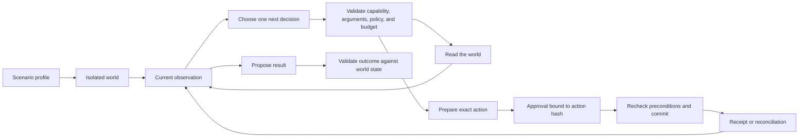

# Simulation Lab: the Atlas Checkout demonstration

The Simulation Lab is a safe, local place to see how Axiom reacts when the same business goal meets different facts. Its flagship scenario is an incident affecting **Atlas Checkout**, a fictional tier-1 checkout service.

The lab is deliberately more than an animation. The application creates an isolated world, exposes typed capabilities to the agent runtime, records the observations returned by those capabilities, freezes consequential actions before approval, and checks the resulting world state. Jira, Slack, Confluence, Atlas Checkout, and their failures are simulated; no request is sent to those real services.

> **Important boundary:** this is a deterministic reference demonstration, not a production environment and not proof that a live language model, external integration, authentication system, or distributed worker fleet is production-ready. The lab establishes local runtime behaviour under controlled evidence. It does not establish live-model planning quality or real vendor delivery.

## The story in one minute

Imagine that checkout errors rise just after a feature-flag change. An incident commander needs to learn what happened, find the service owner and runbook, avoid opening a duplicate Jira incident, coordinate in Slack, and prepare a safe mitigation.

The procedure cannot be identical every time:

- If a Jira incident already exists, the correct action is to reuse it.
- If the owner is missing, the correct action is to ask for that fact instead of guessing.
- If the runbook cannot be read, the correct result may be a useful but incomplete investigation.
- If Slack asks the caller to slow down, the runner should wait according to policy and try again safely.
- If Jira accepted a write but its acknowledgement was lost, retrying blindly could create a duplicate; reconciliation must check what actually happened.
- If the feature flag changes while a mitigation waits for approval, the old approval must not authorize an action based on stale state.

That is the purpose of the lab: hold the mission steady, change the evidence, and make the resulting behaviour visible.

## What is real and what is simulated

| Part | What the demonstration does |
| --- | --- |
| Local HTTP and UI path | Real application code validates requests, creates worlds, starts demonstrations, and returns public state. |
| World state machine | Real simulator code owns isolated records, versions, faults, events, metrics, and a virtual clock. |
| Capability boundary | Real contracts limit which tool IDs and arguments the runtime may use. The adapters behind these demo capabilities read or change only the synthetic world. |
| Adaptive loop | The runtime receives observations one step at a time and selects the next permitted decision from current evidence. Repeatable scripted decisions may be used for the offline demonstration; they are labelled fixtures and are not a live-model evaluation. |
| Action safety | Consequential operations are prepared as exact payloads, bound to an operation identity and relevant source versions, then handled through approval, commit, and reconciliation states. |
| Outcome checks | Trusted code evaluates the synthetic final state. Valid JSON alone is not treated as proof of business success. |
| Atlas Checkout | Fictional. Its health, telemetry, owner, feature flag, and incident state exist only inside a lab world. |
| Jira, Slack, and Confluence | Faithful local stand-ins for the behaviours needed by these scenarios. They do not call Atlassian or Slack and do not use real credentials. |
| Faults and time | Controlled simulator inputs. A rate limit, outage, lost acknowledgement, or concurrent version change is injected locally, and long delays can be represented by advancing virtual time. |

The simulation aims to preserve the **business meaning** of important failure modes, not to reproduce every vendor endpoint or response field. A passing lab run therefore does not certify a real Jira, Slack, or Confluence adapter.

## The mental model



The profile controls starting conditions and faults. It does **not** grant extra authority. The capability registry and policy checks remain the authority boundary.

## The important concepts, in plain language

### World

A world is one private copy of the fictional operating environment. It has a unique ID, a selected profile, a virtual time, synthetic system records, fault settings, an event timeline, and run measurements.

Two worlds do not share incidents, messages, faults, or time. This isolation makes comparisons meaningful: a duplicate found in one world cannot leak into another. Resetting a world restores that profile's starting state; it does not reset the application database or another world.

Worlds are local demonstration state. Unless a deployment explicitly adds durable world storage, assume that they are disposable and may need to be recreated after the local server restarts.

### Virtual clock

The virtual clock is the world's business time. It lets the lab represent a wait without making the presenter sit through it. The Slack mirror records `retryAfterSeconds: 30` and allows one bounded next attempt; it does not sleep or automatically advance the clock. Recovery-metric queries advance virtual time explicitly.

Virtual time has three rules:

1. It moves only through an explicit simulator operation.
2. Timeline events use it so the same profile remains reproducible.
3. It does not alter the computer clock and is not evidence that real wall-clock scheduling has been tested.

### Capability

A capability is a registered operation the runtime may request, such as reading service health, searching incidents, retrieving a runbook, or preparing a message. Its contract defines:

- a stable ID and version;
- a business description;
- strict input and output schemas;
- whether it is a read or a write;
- required authority and approval policy;
- retry, idempotency, and reconciliation behaviour; and
- the adapter that implements it.

In the lab, the adapter talks to the world rather than the internet. Unknown tool IDs, invalid arguments, and actions outside the agent's allowlist are rejected. Adding a profile never silently adds authority.

### Adaptive loop

The loop is **observe → decide → validate → act → observe again**.

The agent receives its mission, relevant permitted context, the observations recorded so far, unresolved questions, available capability contracts, and remaining limits. It proposes one structured next decision: call a capability, ask for a missing fact, or return a typed result. Trusted application code validates that decision before anything happens.

The critical point is that the next decision comes **after** the last real simulator result. The `existing-incident` world can therefore return a Jira record and take a reuse path, while `fresh-incident` can return no record and take a creation path. A profile-specific hardcoded workflow branch is not needed inside the general execution loop.

The repeatable demo policy is useful for verification, but it does not measure how reliably an arbitrary live model will choose good actions. Live-model evaluations are a separate activity.

### Prepared action

A write is not executed directly from model text. The host first resolves references and produces a prepared action containing the exact capability version, destination, arguments, evidence references, policy information, stable operation identity, and relevant source-record versions. A content hash identifies that frozen action.

Preparation has no external effect. It creates a reviewable proposal.

### Approval

Approval is a decision about one prepared action, not blanket permission for the whole run. It binds the reviewer, decision, operation identity, and action hash. If the payload or target changes, that approval no longer matches and a new review is required.

Approval also does not make stale assumptions true. A write still has to pass its business preconditions immediately before commit. The Simulation Lab endpoint that starts a scenario is not itself an approval for every write discovered during that scenario; any paused child run uses the application's normal run-inspector approval journey.

### Commit

Commit executes the stored prepared payload after approval and after rechecking mutable preconditions. The runtime does not ask a model to recreate the payload. In this lab, committing changes only the synthetic world.

A stable operation identity helps the adapter recognize a repeated request. It supports duplicate-safe behaviour where the adapter contract permits it; it is not a universal claim of exactly-once delivery.

### Reconciliation

Sometimes a caller cannot tell whether a remote write succeeded. A timeout or dropped acknowledgement is not the same as a confirmed failure.

Reconciliation asks a provider-specific question using the stable operation identity or authoritative record state: “Did this operation already happen?” In the `jira-lost-ack` profile, the synthetic Jira store records the incident but the first caller response is uncertain. The safe path is to find that recorded effect and recover its receipt, not to create another incident.

### Outcome validation

An outcome validator inspects trusted world state after the run. Depending on the profile, it can check that:

- an existing incident was reused rather than duplicated;
- a prepared write matches the committed record;
- an unknown write outcome was reconciled;
- a stale action did not commit;
- required evidence is present; and
- unresolved facts remain explicitly unresolved.

The result should distinguish **observed facts**, **inferences**, and **unknowns**. A structurally valid answer can still fail an outcome check.

## The seven demonstration profiles

The catalog has exactly seven canonical profiles. The ID is the stable API value; the name is what a person sees.

| Profile ID | Display name | Starting condition or injected event | What to look for |
| --- | --- | --- | --- |
| `fresh-incident` | Fresh regression | Atlas Checkout shows a new regression and no matching Jira incident exists. | The agent gathers evidence before proposing a new consequential action. Reads and writes remain visibly separate. |
| `existing-incident` | Existing Jira incident | The incident search returns a matching existing record. | The plan changes after that observation. The existing incident is reused and a duplicate create is avoided. |
| `missing-owner` | Missing service owner | The authorized service record has no usable owner. | The run asks for or reports the missing fact instead of inventing an owner or destination. |
| `confluence-unavailable` | Runbook unavailable | The synthetic Confluence capability cannot return the runbook. | The outage is recorded as an observation. The run uses only remaining evidence and exposes a partial result or capability gap rather than claiming full completion. |
| `slack-rate-limit` | Slack rate limit then recovery | The first eligible Slack operation is rate-limited and provides retry guidance. | Policy permits one bounded next attempt, and both the rejected effect and successful new operation remain visible. There is no tight retry loop. |
| `jira-lost-ack` | Jira commit with lost acknowledgement | Synthetic Jira applies the write, but the acknowledgement is lost. | The write enters an unknown-outcome state, reconciliation finds the committed record by stable identity, and no duplicate is created. |
| `changed-flag-version` | Feature flag changes during approval | The relevant flag version changes after preparation but before commit. | The precommit version check rejects the stale action. The old approval does not authorize a newly prepared payload. |

These profiles are controlled examples, not claims that every possible incident or vendor failure is modeled.

## Guided browser demonstration

### 1. Start the local application

From the source directory:

```bash
cd app
python3 server.py --port 8765
```

Open <http://127.0.0.1:8765>. The reference server is intended for loopback development use; do not expose it directly to a public network.

### 2. Create the baseline world

Open **Simulation Lab**, choose **Fresh regression**, and select **Create sandbox mirror**. Before starting, note:

- the world ID and profile;
- the virtual time;
- Atlas Checkout health and feature-flag version;
- the visible Jira, Slack, and Confluence stand-ins;
- enabled faults; and
- the empty or seed-only timeline.

### 3. Start the guided run

Select **Start guided demo**. Watch the timeline rather than only the final summary. A useful review follows this order:

1. Which fact was observed?
2. Which next action changed because of that fact?
3. Was the requested capability permitted and schema-valid?
4. Did a write become a prepared action before it could commit?
5. Which approval and preconditions applied?
6. What receipt or reconciliation evidence was recorded?
7. Did the final-state validator find the requested business result?

If the response provides a linked agent run, select **Open run** to inspect its action/observation sequence and any waiting approval. The lab's `/start` operation starts the demonstration; it is not a substitute for the separate exact-action approval.

### 4. Compare evidence-dependent paths

Create a new world with **Existing Jira incident** and start it. Compare its tool order with the baseline. The meaningful difference is not different prose; it is that the incident-search observation changes the next action and prevents another create.

Then try these in order:

1. **Jira commit with lost acknowledgement** — inspect unknown outcome, reconciliation, and the final incident count.
2. **Feature flag changes during approval** — inspect the prepared version, changed current version, and refused stale commit.
3. **Slack rate limit then recovery** — compare the first definitive 429 receipt with the separately prepared successful retry.
4. **Missing service owner** — verify that an unresolved question is visible.
5. **Runbook unavailable** — verify that the final result says what could and could not be established.

### 5. Use explicit fault controls

The active world's fault panel lists fault IDs supported by that world. Enable or disable one before starting the run. Fault changes affect only that world. Prefer a new or reset world for each comparison so a previous committed effect cannot change the conclusion.

### 6. Reset and repeat

Select **Reset** to begin a new generation from the selected profile's seed state, virtual time, fault defaults, and counters. Prior-generation events and operation receipts remain archived for audit; the active view starts with the new generation. Reset is intentionally scoped to the sandbox world. It does not remove real application records or modify another world.

## REST API outline

The UI uses the following local JSON API. Examples assume the default loopback address:

```bash
BASE_URL=http://127.0.0.1:8765
```

| Method and path | Request | Response | Meaning |
| --- | --- | --- | --- |
| `GET /api/simulation-lab` | None | `{ "profiles": [...], "worlds": [...], "activeWorldId": string|null }` | Load the profile catalog, public world summaries, and current selection. |
| `POST /api/simulation-lab/worlds` | `{ "profileId": string }` | `{ "world": {...} }` | Create an isolated world from one canonical profile. |
| `GET /api/simulation-lab/worlds/:id` | None | `{ "world": {...} }` | Read the current public projection of one world. |
| `POST /api/simulation-lab/worlds/:id/reset` | `{}` | `{ "world": {...} }` | Restore that world's profile seed. |
| `POST /api/simulation-lab/worlds/:id/faults` | `{ "faultId": string, "enabled": boolean }` | `{ "world": {...} }` | Change one advertised fault in that world. |
| `POST /api/simulation-lab/worlds/:id/start` | `{}` | `{ "run": {...}, "agentRun"?: {...}, "world": {...} }` | Start the guided scenario and return its run plus the updated world. `agentRun` is present only when a linked adaptive child run exists. |

### API walkthrough

List the profiles:

```bash
curl -s "$BASE_URL/api/simulation-lab"
```

Create the baseline world:

```bash
curl -s -X POST "$BASE_URL/api/simulation-lab/worlds" \
  -H 'Content-Type: application/json' \
  -d '{"profileId":"fresh-incident"}'
```

Copy the returned world ID into `WORLD_ID`, then inspect it:

```bash
WORLD_ID=replace-with-returned-world-id
curl -s "$BASE_URL/api/simulation-lab/worlds/$WORLD_ID"
```

Start the guided run:

```bash
curl -s -X POST "$BASE_URL/api/simulation-lab/worlds/$WORLD_ID/start" \
  -H 'Content-Type: application/json' \
  -d '{}'
```

Toggle only a fault advertised by that world's response:

```bash
curl -s -X POST "$BASE_URL/api/simulation-lab/worlds/$WORLD_ID/faults" \
  -H 'Content-Type: application/json' \
  -d '{"faultId":"replace-with-advertised-fault-id","enabled":true}'
```

Reset the world:

```bash
curl -s -X POST "$BASE_URL/api/simulation-lab/worlds/$WORLD_ID/reset" \
  -H 'Content-Type: application/json' \
  -d '{}'
```

Use IDs returned by the API rather than guessing them. Invalid profile, world, or fault IDs should produce a visible validation error; clients should not silently create a substitute world or fault.

## Reading a run correctly

A polished final message can be misleading. Prefer the durable evidence in this order:

1. **Capability observation:** the exact typed result or classified error returned by the simulator.
2. **Prepared action:** the frozen destination, arguments, source versions, operation identity, and hash.
3. **Approval record:** who approved or rejected which exact hash.
4. **Commit record:** whether preconditions passed and what the adapter reported.
5. **Reconciliation record:** how an uncertain outcome was resolved.
6. **Outcome validation:** which final-state conditions are satisfied, contradicted, or unknown.
7. **Agent summary:** a useful explanation, but not the source of truth.

For retries, also compare the operation identity and world record count. Two successful-looking log lines do not prove that only one effect occurred.

## Safety boundaries

- The server is a local reference server with development identities, not corporate authentication or tenant isolation.
- Simulator adapters must not contain real credentials or send outbound requests. Real integrations belong behind separately reviewed production adapters.
- A world can mutate only its own synthetic records. Fault controls are allowlisted and world-scoped.
- Retrieved runbook text and other tool content are evidence, not instructions that can widen authority or remove an approval.
- A model or fixture can propose a tool call; trusted code decides whether the capability, arguments, limits, and policy permit it.
- Prepared actions must be immutable after approval. Any changed target or payload requires a new preparation and approval.
- Writes with an unknown result must be reconciled according to the adapter contract before any retry.
- Mutable business preconditions must be reread before commit. A matching payload hash alone does not prove that the action remains safe.
- Reset and fault injection are demonstration controls. They are not production recovery or chaos controls.
- Scripted scenario success verifies deterministic runtime behaviour, not live-model quality, security against every prompt injection, external API compatibility, load handling, or failover.
- Do not call this reference production-ready without real authentication, tenant isolation, least-privilege credentials, observability, retention controls, provider evaluations, adapter reconciliation tests, and load/failover validation.

## Extending the lab without weakening it

Use this sequence when adding a profile, capability, or business domain.

### 1. Define the business result first

Describe the authoritative final state, not merely a desired sentence. For example: “one incident exists for this fingerprint and its ID is returned” is testable; “handled the incident” is not.

### 2. Add a profile as data

Give it a stable ID, plain display name, explanation, deterministic seed records, virtual start time, and explicit supported faults. A profile should change facts or failures, not smuggle a new planner into the runtime.

### 3. Model records and versions

Represent the smallest state needed to prove the scenario: record IDs, ownership, source freshness, feature-flag version, operation keys, message IDs, and receipts. Preserve enough provenance for the run inspector and validator.

### 4. Register a capability contract

Declare strict schemas, semantic field meaning, read/write effect, authorization scope, adapter binding, limits, idempotency class, retry rule, and reconciliation method. Discovery may help an agent find an allowed capability; it must not authorize it.

### 5. Implement the simulator adapter

Make the adapter operate only on a supplied world. Validate all inputs, return typed outputs, and record one concise timeline event for each meaningful result. Keep vendor-specific behaviour in the adapter, not in the general planning loop.

### 6. Add faults as explicit state transitions

Specify the trigger, scope, duration, whether it is one-shot or persistent, the typed error, and any virtual-time effect. Include a stop condition. Never use random, unbounded failure injection in a guided demonstration.

### 7. Preserve the write lifecycle

Keep observation, preparation, approval, precondition check, commit, receipt, and reconciliation as separate records. Test payload changes, duplicate operation keys, and source-version changes.

### 8. Add a trusted validator

Read final world state directly. Report satisfied, contradicted, and unknown conditions with evidence references. Do not reuse the agent's own summary as the validator.

### 9. Test variations, not just the happy path

At minimum, cover a normal run, existing record, missing fact, denied or unavailable capability, transient rate limit, committed write with lost acknowledgement, changed business condition, duplicate start, reset isolation, strict schemas, and deterministic replay. Keep deterministic fixture tests separate from live-model evaluation reports.

### 10. Expose only a public projection

The API and UI should return the fields a presenter needs, not secrets, internal exception objects, or unrelated application state. Add keyboard, screen-reader, loading, empty, and error-state checks to the browser journey.

The local implementation is centered in [`app/simulation_lab.py`](../app/simulation_lab.py), with HTTP integration in [`app/server.py`](../app/server.py). Read the implementation and focused tests before extending the API; this guide explains the contract but is not a substitute for executable verification.

## Design sources

These primary sources informed the lab's design. They are references, not claims that Axiom uses those products internally or implements every behaviour they describe.

### Inspectable workflow demonstrations

- n8n distinguishes manual, partial, and production executions: [Executions](https://docs.n8n.io/build/understand-workflows/understand-executions/types-of-executions/).
- n8n documents replaying a past execution with copied data: [Debug and re-run past executions](https://docs.n8n.io/build/understand-workflows/understand-executions/debug-executions/).
- n8n describes pinned mock data for stable development runs: [Data pinning](https://docs.n8n.io/build/work-with-data/pin-and-mock-data/).
- n8n's human-in-the-loop guidance shows reviewing the exact parameters of a proposed tool call: [Human-in-the-loop for AI tool calls](https://docs.n8n.io/build/integrate-ai/ai-examples/human-in-the-loop-for-tools/).

### Durable execution and retries

- Temporal explains durable execution through recorded events and replay: [Temporal Platform](https://docs.temporal.io/temporal) and [Tasks](https://docs.temporal.io/tasks).
- Temporal requires deterministic workflow logic and places external I/O in activities: [Workflow Definition](https://docs.temporal.io/workflow-definition).
- Temporal discusses durable agent loops and human approvals: [Durable AI](https://docs.temporal.io/ai).

The local lab does not claim to be a Temporal deployment. These sources support the separation of deterministic orchestration state from fallible external effects.

### Vendor behaviours represented by the simulator

- Slack documents Web API success/error envelopes and HTTP failures: [Using the Slack Web API](https://docs.slack.dev/apis/web-api/).
- Slack documents `Retry-After` handling for HTTP 429 responses: [Web API rate limits](https://docs.slack.dev/apis/web-api/rate-limits/).
- Slack's message method defines the real operation a production adapter would eventually need to implement: [`chat.postMessage`](https://docs.slack.dev/reference/methods/chat.postMessage/).
- Atlassian documents Jira issue creation and search operations: [Jira Cloud issue APIs](https://developer.atlassian.com/cloud/jira/platform/rest/v3/api-group-issues/).
- Atlassian documents Jira Cloud retry and rate-limit headers: [Jira Cloud rate limiting](https://developer.atlassian.com/cloud/jira/platform/rate-limiting/).
- Atlassian's Confluence page API documents versioned updates and conflicts: [Confluence Cloud page APIs](https://developer.atlassian.com/cloud/confluence/rest/v2/api-group-page/).

### Tracing, controlled faults, and evaluation

- OpenTelemetry defines traces as spans linked by trace and parent identifiers: [Trace API](https://opentelemetry.io/docs/specs/otel/trace/api/) and [Trace concepts](https://opentelemetry.io/docs/concepts/signals/traces/).
- The [Principles of Chaos Engineering](https://principlesofchaos.org/) recommend a steady-state hypothesis, real-world events, controlled experiments, and minimizing blast radius.
- AWS Fault Injection Service documents reusable experiment templates and stop conditions: [Experiment templates](https://docs.aws.amazon.com/fis/latest/userguide/experiment-templates.html) and [Stop conditions](https://docs.aws.amazon.com/fis/latest/userguide/stop-conditions.html).
- Anthropic explains task suites, graders, transcripts, and repeated trials for agent evaluation: [Demystifying evals for AI agents](https://www.anthropic.com/engineering/demystifying-evals-for-ai-agents).
- OpenAI documents reproducible agent evaluation and trace grading: [Agent evals](https://developers.openai.com/api/docs/guides/agent-evals).
- [τ-bench](https://arxiv.org/abs/2406.12045) motivates checking final environment state and repeated-run reliability; [AgentDojo](https://arxiv.org/abs/2406.13352) provides a reference for evaluating agents under prompt-injection attacks.

## What a successful demonstration proves

A successful run proves that, for the selected controlled profile and current local implementation, the runtime processed observations, enforced the simulated capability and effect rules, and reached the validator's expected synthetic state.

It does **not** prove that a live model will make the same decisions, that real Jira/Slack/Confluence requests will succeed, that an organization has configured correct permissions, or that the system meets production security, availability, and compliance requirements. Those require separate integration tests, model evaluations, security review, operational testing, and human ownership.
