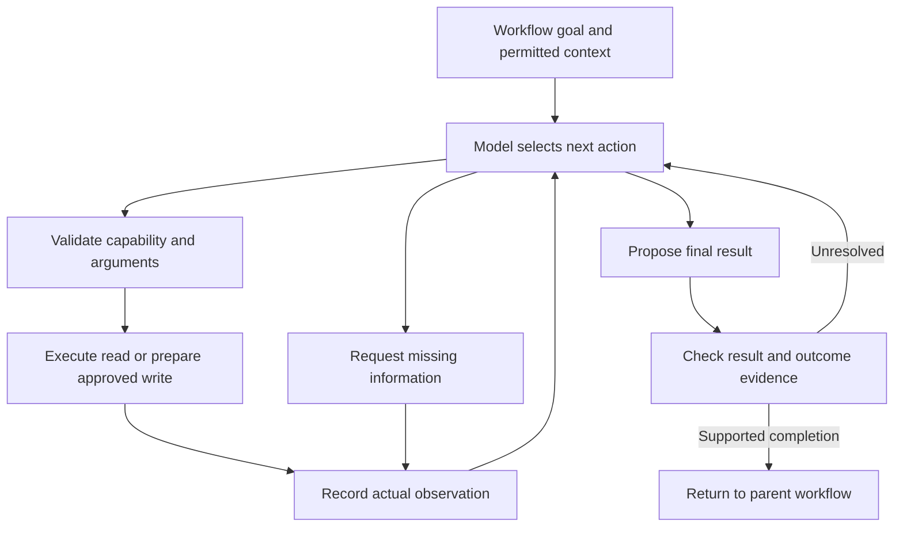

# An adaptive agent factory for custom business workflows

## The central recommendation

Build **goal-based workflow nodes powered by a shared adaptive AI runtime**. Keep exact Action nodes for operations whose procedure is already known. A Goal Agent receives an objective, authorized context and tools, a result contract, and operating limits. It chooses its next action from the evidence, observes the result, and changes its approach when the situation changes.

The factory creates reusable agent specifications. The runtime turns each specification into behaviour for a particular case. Developers register capabilities once; administrators compose business workflows; AI determines the necessary work inside each agent's permitted scope. The Send Mail example is one small use of this architecture. Typed bindings and message profiles are useful infrastructure, but cannot by themselves provide this adaptive intelligence.

This is an architectural synthesis, not a claim to have invented planning agents or surpassed every existing product. Its value must be demonstrated through useful outcomes, reduced configuration, and measurable reliability.

## What actually changes dynamically

Consider a reusable **Resolve Discrepancy** agent placed after invoice intake. Its mission is to explain the discrepancy and prepare the permitted next action. The administrator does not draw a separate branch for every possible explanation.

| Evidence discovered during execution | The agent's next actions | Result that should be established |
| --- | --- | --- |
| Invoice quantity differs from the purchase order | Read receipt records; compare delivered and billed quantities; prepare an exception if unresolved. | Reconciled quantities or an owned discrepancy with source records. |
| The same invoice was already processed | Inspect the existing transaction and case; avoid creating another request. | Existing record identified and the case linked or escalated appropriately. |
| Required receipt is missing | Request the missing evidence; resume when it arrives. | A visible blocked state instead of invented facts. |
| A source service is unavailable | Try an allowed alternative or report the capability gap. | An evidence-backed partial outcome; no false completion. |

The same runtime can host an onboarding agent, support agent, document analyst, or service investigator. Different goals and allowed tools produce different strategies. Even the same saved agent can take different paths for two different cases.

These invoice examples describe the target architecture; they are not claims that a finance integration is present in the supplied local reference.

## Three levels of responsibility

**Tools are executable capabilities.** Examples include searching cases, retrieving a document, reading an account, preparing an entitlement request, or creating a record. A tool declares its inputs, outputs, effects, authorization requirements, and adapter version. MCP, HTTP APIs, and local functions are possible transports. Tools do not gain authority because the model selected them.

**Agents are goal-directed configurations.** An agent specification contains its mission, operating instructions, permitted tools and initial context, result schema, limits, and escalation rules. It uses one common runtime. Creating an agent does not normally require generating a new executable program.

**Workflows are business commitments and dependencies.** They define required stages, ownership, approvals, deadlines, and the conditions under which downstream work may proceed. Some stages are deterministic Actions; others are adaptive Goal Agents. A model may revise its internal approach without removing a mandatory business approval or changing the overall authorized mission.

This division follows the distinction between predefined workflows and model-directed agents described by [Anthropic](https://www.anthropic.com/engineering/building-effective-agents). The proposed hybrid is our application of that distinction to an enterprise agent factory.

## The execution loop

The outcome-evidence check is a target architectural responsibility. The local reference's exact completion checks are stated in its verification report; schema validation alone is not that full verifier.

1. **Observe.** Load the agent's mission, permitted initial facts, current observations, unresolved questions, and available tool contracts.
2. **Decide.** Ask the model for one structured next decision: invoke a tool, request missing information, or propose a final result. Include a brief operational explanation, not a request to expose private reasoning.
3. **Validate.** Check the decision against the actual tool registry, argument schema, contextual bindings, limits, and policy. A model cannot invent tools or grant itself permissions.
4. **Act.** Execute a permitted read. For a write requiring review, prepare the exact payload and pause for approval before committing it.
5. **Observe again.** Record the real tool result, error, or human answer. The next model decision receives this new evidence.
6. **Conclude or adapt.** Validate a proposed output and any configured outcome checks. Otherwise continue within the budget or expose why the case is blocked.

The important property is a fresh decision after an observation. A language model generating a static sequence once does not provide the same adaptability. [ReAct](https://arxiv.org/abs/2210.03629) is a foundational example of interleaving action selection and environmental feedback; its benchmark results do not establish reliability for this product or its domains.

For production effects, bind important source-record versions and business preconditions as well as the payload. If account status or policy changes while an action awaits approval, re-read the relevant state before committing and prepare a new decision when its assumptions no longer hold. Exact payload approval alone does not establish freshness. This is an adapter/policy requirement beyond the local fixture's content-hash check.

## How an agent knows what to do

Its behaviour depends on **mission + current facts + available capabilities + previous observations + business constraints**. The immediate predecessor's name is only incidental information.

A Communicate Outcome agent might find a failed request and prepare a failure explanation, find several successful records and consolidate an update, or discover that no authorized recipient is available and request clarification. A Service Investigator may choose deployment diagnostics after a recent release, then switch to a dependency check when the first result contradicts its hypothesis. Neither needs a hardcoded `if previous agent is X` for every workflow.

The model still needs a meaningful objective. It cannot reliably infer whether an administrator wants a customer update, an internal escalation, or a regulatory notice merely from the existence of a Jira record. Good defaults and AI suggestions can reduce configuration; ambiguous business intent remains a real question.

## Context must be discoverable, not unlimited

Use explicit bindings for guaranteed starting inputs. Then expose authorized retrieval tools so the agent can discover facts it did not initially know it needed. A context service should return relevant excerpts or records with source identity, timestamp, access scope, and provenance. Keep durable observations outside the model's context window; select what a decision needs without losing the original record.

For a large tool catalog, first restrict candidates by the caller's permissions and agent scope. Search or rank within that permitted set, then load the selected tools' full schemas. Retrieval changes which capabilities the model sees; it does not authorize new ones. [Context engineering guidance](https://www.anthropic.com/engineering/effective-context-engineering-for-ai-agents) and [tool discovery guidance](https://www.anthropic.com/engineering/advanced-tool-use) motivate these choices. Large-catalog search and a production context service are expansion work, not features established by the local demonstration.

Do not turn retrieved documents into instructions with higher authority. Treat tool content as evidence, validate model actions independently, and evaluate adversarial documents. [AgentDojo](https://arxiv.org/abs/2406.13352) is a relevant evaluation reference; adopting a prompt alone is not an injection-resistance guarantee.

## Where MCP and multiple agents fit

MCP can expose and invoke capabilities. It is not the business planner, outcome verifier, permission engine, or durable workflow scheduler. Tool annotations can inform a host, but the host needs to enforce the actual policy; the [MCP project's discussion of tool annotations](https://blog.modelcontextprotocol.io/posts/2026-03-16-tool-annotations/) makes this distinction useful.

Start with one adaptive runtime per goal. Delegate only when investigations can proceed independently or require separately scoped specialist tools. Child agents receive a limited task, context, and budget and return evidence-backed results. They do not silently inherit unlimited authority. Parallel delegation, shared work deduplication, and conflict resolution need explicit engineering and evaluation; adding more model calls is not inherently an improvement.

Keep the persistent session, planning loop, and execution adapters separable. [Anthropic's managed-agent architecture](https://www.anthropic.com/engineering/managed-agents) provides a current example of separating these concerns. That supports the proposed interface design; it does not require adopting its paid hosted service.

## Features that would make this product useful

**Behaviour previews.** Before publication, run the same agent against changed facts: a missing record, duplicate request, contradictory evidence, permission denial, and unavailable service. Show which actions and outcomes changed. Measure whether it adapts appropriately rather than merely producing different prose.

**Outcome evidence.** Display each requested condition as satisfied, contradicted, or unknown, with supporting authoritative observations. A valid JSON result is structurally valid; it is not automatically factually correct. The domain owner supplies machine-checkable success conditions where possible.

**Capability-gap explanations.** When the agent cannot complete the mission, identify the missing tool, fact, or permission. For example, “The account exists, but entitlement verification is unavailable.” Suggest the next useful step without fabricating completion or silently widening access.

**Plan-change history.** Show “Receipt search found no record; requesting the receiving document” next to the actual observation. This makes adaptation understandable. Model explanations remain explanations; the recorded tool outputs establish what happened.

**Reviewed learning.** Mine successful traces for candidate procedures or instructions, compare them on held-out cases, and propose a new agent version. Keep failures and exceptions in the evaluation set. Do not automatically rewrite published agents from every conversation.

These are product priorities, not claims that every item is implemented or unprecedented.

## What should count as success

Test final system state and repeated-run reliability, not just whether an agent can call a tool or produce an attractive explanation. [τ-bench](https://arxiv.org/abs/2406.12045) evaluates against goal database states and repeated trials; those evaluation ideas are relevant even though its historic model scores cannot predict this product's performance.

Track verified task completion, unnecessary tool calls, duplicate effects, escalation quality, time and model cost per completed case, and forbidden-action attempts. Separate model-quality evaluation from deterministic runtime tests. A scripted provider can establish how the runtime handles decisions and observations, but cannot establish that a live model will choose the right decision.

## Honest boundary

The factory can compose newly encountered tasks from existing authorized capabilities. It cannot guarantee arbitrary tasks, invent a missing enterprise API, determine unstated policy, or make a valid schema prove business truth. New executable capabilities need developer implementation and review. A future development agent could propose that code in an isolated environment with tests; that is a separate development workflow, not unreviewed production self-modification.

The accompanying verification report identifies the exact implemented features and remaining integration work. The production build prompt extends this architecture without treating proposed features as delivered functionality.
